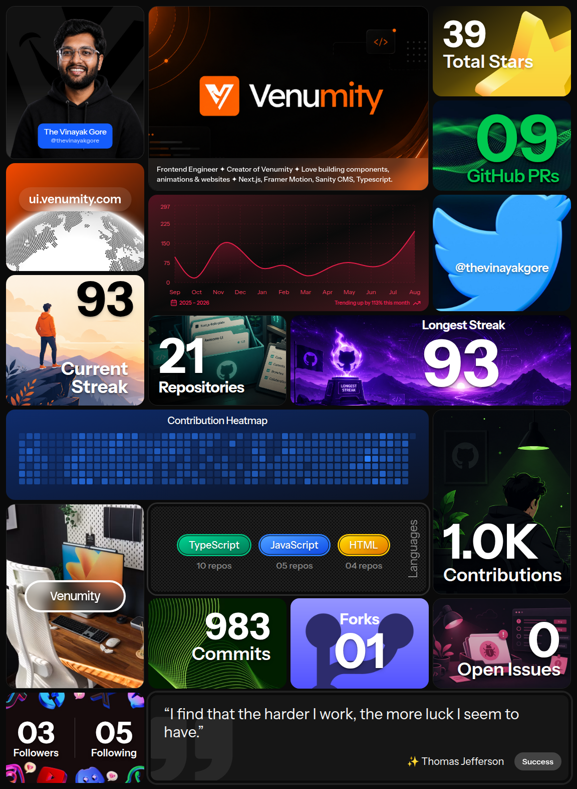
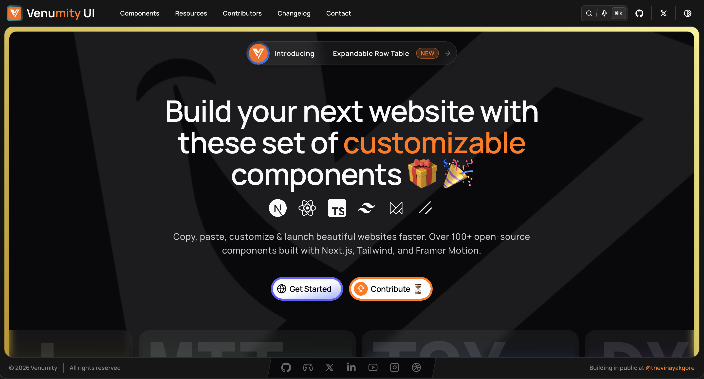
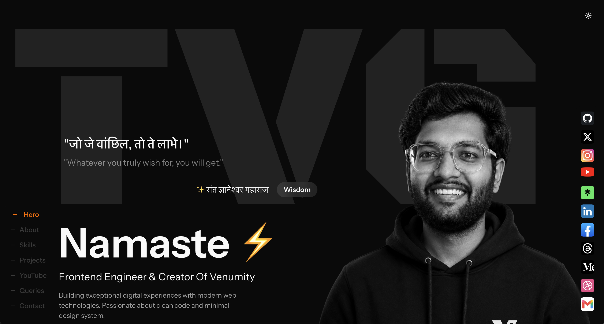
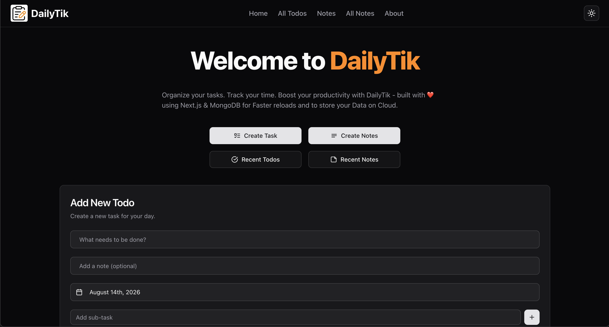
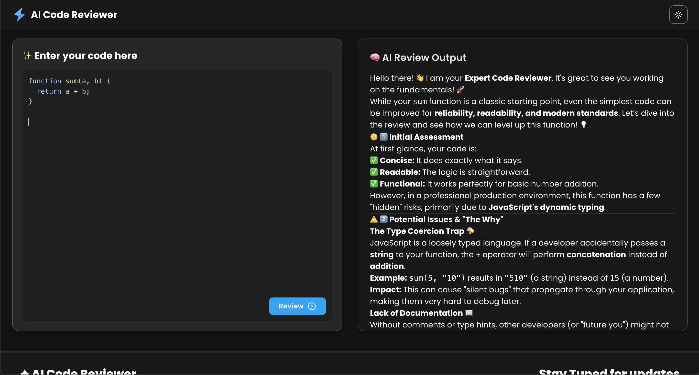
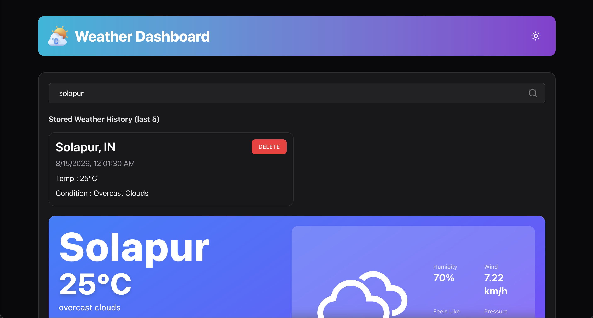
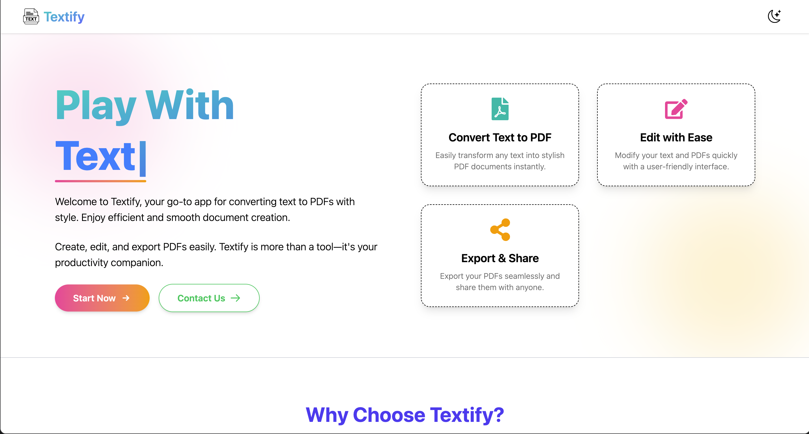
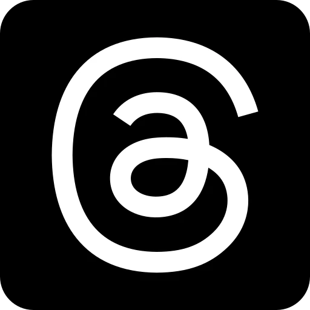

<!-- Bento Card - Updated Daily -->

  

<!-- Star this profile CTA -->

  

---

  
  
  
  
  
  
  
  
  
  
  
  
  
  
  

---

<table>
  <tr>
    <td width="50%">
      <h3 align="center">🎨 Venumity UI</h3>
      

        
      

      

        
        
        
        
        
      

      
Open-source UI library with <strong>copy-paste components</strong> and auto-dependency installation. Built with Next.js, Tailwind CSS, Shadcn UI, and Framer Motion.

    </td>
    <td width="50%">
      <h3 align="center">🖥️ The Vinayak Gore</h3>
      

        
      

      

        
        
        
        
        
        
      

      
Modern, minimal portfolio with <strong>smooth animations</strong> and working contact form. Built with Next.js 16, TypeScript, Tailwind CSS, Shadcn UI, and Resend.

    </td>
  </tr>
  <tr>
    <td width="50%">
      <h3 align="center">📅 DailyTik</h3>
      

        
      

      

        
        
        
        
      

      
Daily task manager with focus mode, streaks, and progress analytics. Helps you stay organized and productive every day.

    </td>
    <td width="50%">
      <h3 align="center">🤖 AI Code Reviewer</h3>
      

        
      

      

        
        
        
        
      

      
AI-powered code review tool with real-time suggestions and streaming responses, powered by Google Gemini AI.

    </td>
  </tr>
  <tr>
    <td width="50%">
      <h3 align="center">🧠 RecallCard</h3>
      

        
      

      

        
        
        
        
        
      

      
Modern memory card game with flip animations, timer, high score, and celebration effects. Built with React + TypeScript.

    </td>
    <td width="50%">
      <h3 align="center">🔑 KeyStore</h3>
      

        
      

      

        
        
        
        
      

      
Secure password manager with end-to-end encryption, password generator, and secure vault for storing credentials safely.

    </td>
  </tr>
  <tr>
    <td width="50%">
      <h3 align="center">⌨️ FingSprint</h3>
      

        
      

      

        
        
        
        
      

      
Interactive typing speed test with real-time WPM tracking, accuracy metrics, and progress insights.

    </td>
    <td width="50%">
      <h3 align="center">🌤️ Weather Dashboard</h3>
      

        
      

      

        
        
        
        
      

      
Real-time weather dashboard with 5‑day forecast, search functionality, and dark/light mode.

    </td>
  </tr>
  <tr>
    <td width="50%">
      <h3 align="center">📝 Textify</h3>
      

        
      

      

        
        
        
      

      
Collection of text utilities – case converter, word/character counter, formatter, and export options.

    </td>
    <td width="50%">
      <h3 align="center">📋 DooZen</h3>
      

        
      

      

        
        
      

      
Simple and elegant To‑Do web app to help you stay organized and productive.

    </td>
  </tr>
</table>

  
  
  
  
  
  
  

---

<!-- Star CTA -->

  

<!-- Footer Wave -->

  

