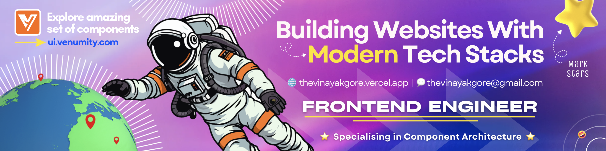
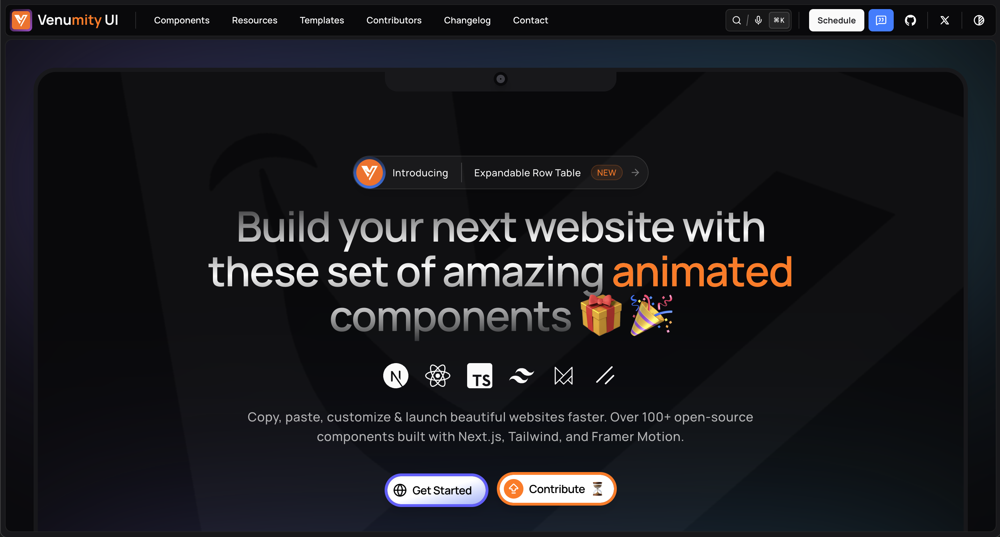
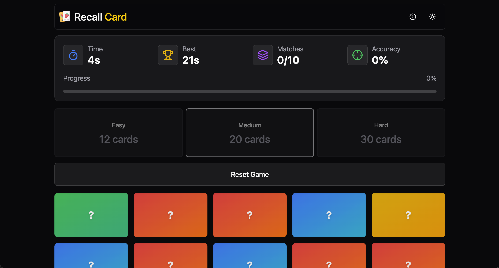
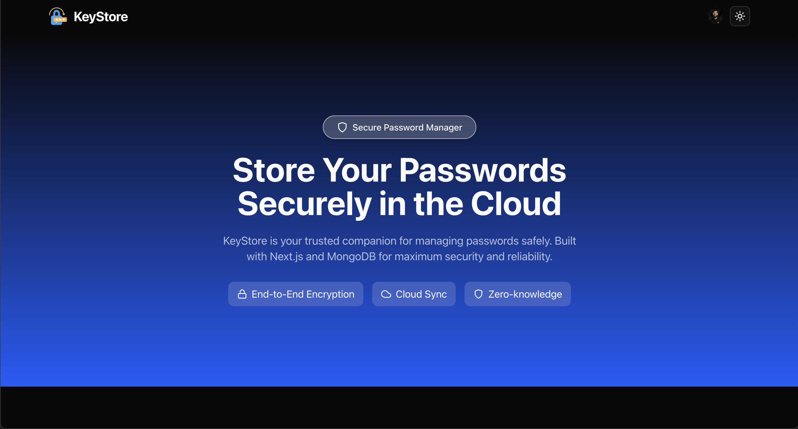
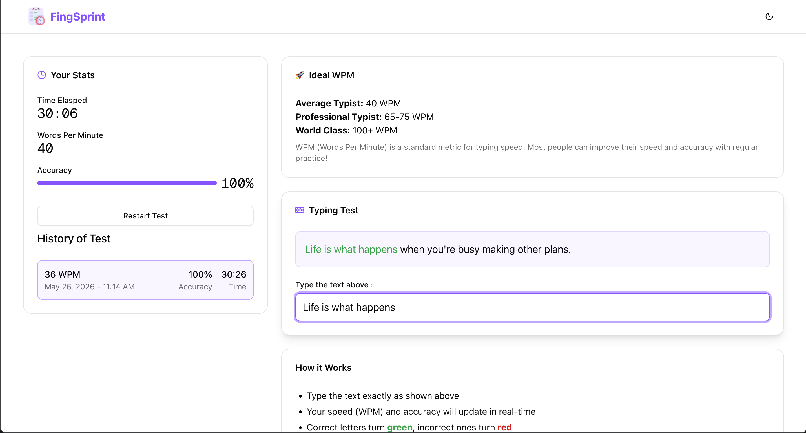
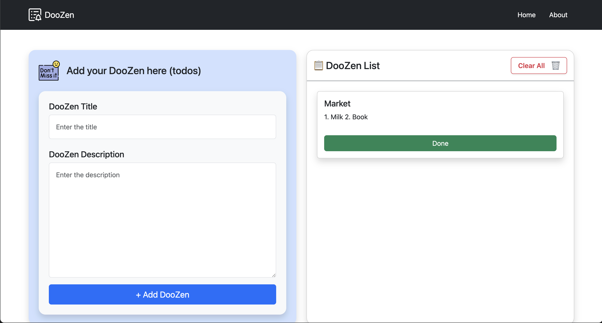

<!-- Header Banner -->

  

<!-- Animated Typing Header -->

  

<!-- Profile Views + Followers + Stars -->

  
  
  
  
  
  

---

<!-- About Me -->

# 😎 About Me

- 🎓 **B.Tech Engineering** · VIIT Pune · 2025 Batch
- 💼 **Frontend Engineer** focused on building modern UI with Next.js, React & TypeScript
- 🎨 Crafting **high-quality UI components, templates & design systems** for real-world products
- ✨ Passionate about **motion animations (Framer Motion)** to create smooth, engaging user experiences
- 🚀 Built **[Venumity UI](https://venumity.vercel.app/)** – a growing library of reusable, production-ready components
- 🌱 Exploring **AI-powered UI** & advancing toward full-stack (MERN) capabilities
- ❤️ Love turning ideas into **fast, beautiful & conversion-focused interfaces**
- 🌐 Portfolio → **[thevinayakgore.vercel.app](https://thevinayakgore.vercel.app/)**
- 📫 Reach me at **thevinayakgore@gmail.com**

 

---

<!-- Star this profile CTA -->

  

---

## 🛠️ Tech Stack

  
  
  
  
  
  
  
  
  
  
  
  
  
  
  

---

## 🚀 Featured Projects

> ⭐ **Star these repos if they inspire you!**

<table>
  <tr>
    <td width="50%">
      <h3 align="center">🎨 Venumity UI</h3>
      

        
      

      

        
        
        
        
        
      

      
Open-source UI library with <strong>copy-paste components</strong> and auto-dependency installation. Built with Next.js, Tailwind CSS, Shadcn UI, and Framer Motion.

    </td>
    <td width="50%">
      <h3 align="center">📅 DailyTik</h3>
      

        
      

      

        
        
        
        
      

      
Daily task manager with focus mode, streaks, and progress analytics. Helps you stay organized and productive every day.

    </td>
  </tr>
  <tr>
    <td width="50%">
      <h3 align="center">🤖 AI Code Reviewer</h3>
      

        
      

      

        
        
        
        
      

      
AI-powered code review tool with real-time suggestions and streaming responses, powered by Google Gemini AI.

    </td>
    <td width="50%">
      <h3 align="center">🧠 RecallCard</h3>
      

        
      

      

        
        
        
        
        
      

      
Modern memory card game with flip animations, timer, high score, and celebration effects. Built with React + TypeScript.

    </td>
  </tr>
  <tr>
    <td width="50%">
      <h3 align="center">🔑 KeyStore</h3>
      

        
      

      

        
        
        
        
      

      
Secure password manager with end-to-end encryption, password generator, and secure vault for storing credentials safely.

    </td>
    <td width="50%">
      <h3 align="center">⌨️ FingSprint</h3>
      

        
      

      

        
        
        
        
      

      
Interactive typing speed test with real-time WPM tracking, accuracy metrics, and progress insights.

    </td>
  </tr>
  <tr>
    <td width="50%">
      <h3 align="center">🌤️ Weather Dashboard</h3>
      

        
      

      

        
        
        
        
      

      
Real-time weather dashboard with 5‑day forecast, search functionality, and dark/light mode.

    </td>
    <td width="50%">
      <h3 align="center">📝 Textify</h3>
      

        
      

      

        
        
        
      

      
Collection of text utilities – case converter, word/character counter, formatter, and export options.

    </td>
  </tr>
  <tr>
    <td width="100%" colspan="2">
      <h3 align="center">📋 DooZen</h3>
      

        
      

      

        
        
      

      
Simple and elegant To‑Do web app to help you stay organized and productive.

    </td>
  </tr>
</table>

---

## 💡 Thought of the Day

  

---

## 🤝 Let's Connect

  
  
  
  
  
  
  

<!-- Buy Me a Coffee -->

---

<!-- Star CTA -->

  

<!-- Footer Wave -->

  

