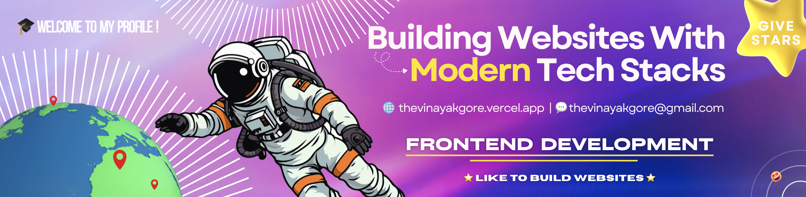
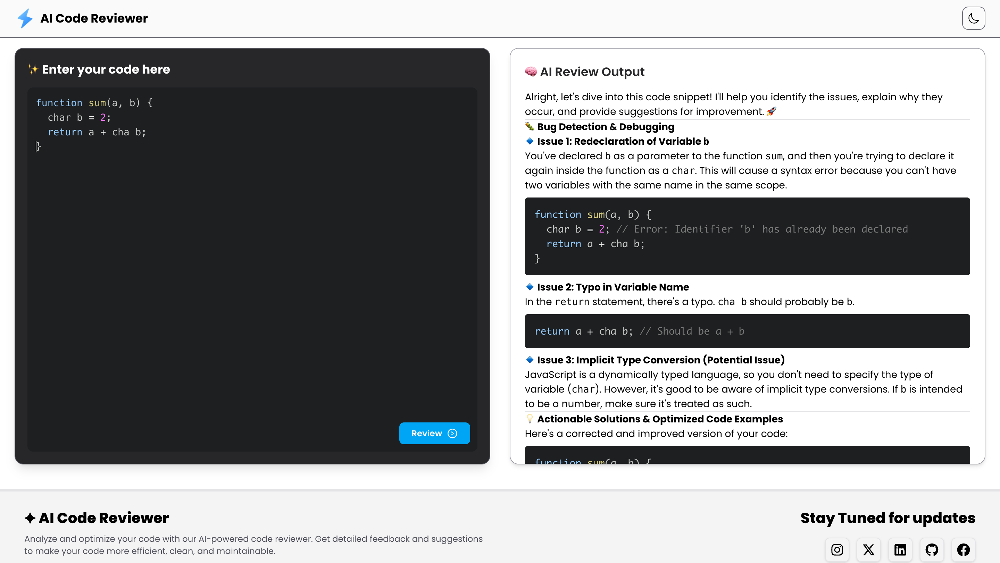

<!-- You can keep the Night Owl image or replace it -->

  

<!-- Customize the header with your name -->

#  👋 Hey there ! I'M Vinayak Gore

_🚀 Frontend Web Developer_
 

<!-- Customize your intro -->

I love to build Websites in Next.js !

✨ Learn | Build | Inspire  
🌱 Making my Portfolio more stronger  
💼 Frontend Web Developer  
❤️ Passionate about Building Modern Websites  
🌐 Visit my [Website](https://thevinayakgore.vercel.app/) for more stuffs.

<!-- Profile Count Badge - replace username -->

  

<h1 align="left">😻 Tech Stacks</h1>
  <ul align="left">
    <li>Next.Js</li>
    <li>React</li>
    <li>Typescript</li>
    <li>Javascript</li>
    <li>Sanity CMS</li>
    <li>Tailwind CSS</li>
    <li>Bootstrap</li>
    <li>Framer Motion</li>
    <li>MERN Stack</li>
  </ul>

<h1 align="left">🌐 Latest Projects</h1>

    
    
    
    
</ul>

<h1 align="left">🪄 Thought of the Day</h1>

<!--STARTS_HERE_QUOTE_CARD-->

    

<!--ENDS_HERE_QUOTE_CARD-->

<h1 align="left">🤝 Let's Connect</h1>

  

<!-- Buy me a coffee -

 -->

<!-- Footer -->

  

